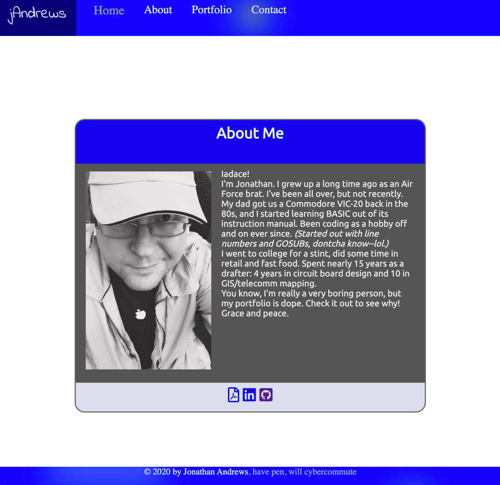
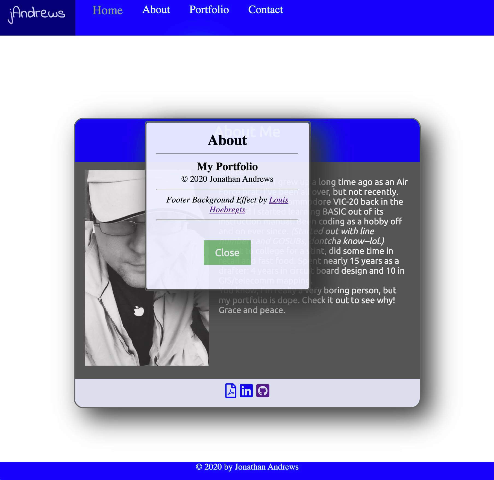
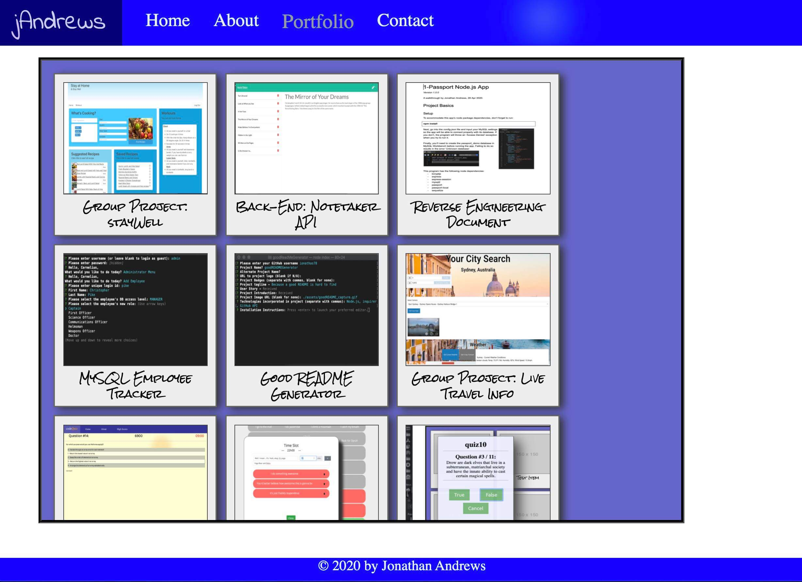
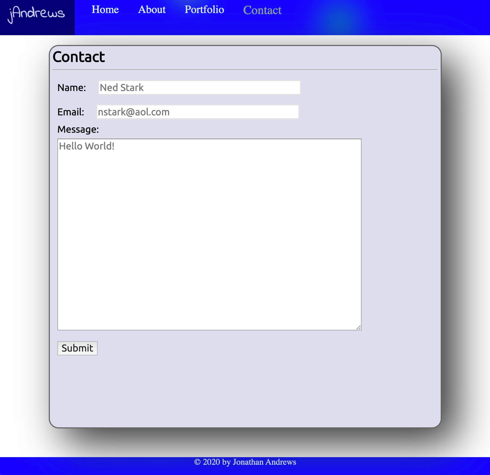

# 02 Unit 02 CSS and Bootstrap: Responsive Portfolio

> A portfolio is a vital piece of any programmer's resume, and I didn't have one.
> It was time to fix that.

I built a web site with three basic pages (an index, a contact page, and a page
to show off a gallery of my projects) using mobile responsive design processes. 
It showed off the CSS and Javascript skills I've gained in class.

## User Story

```
AS A programmer
I WANT TO have an eye-catching portfolio site
SO THAT I can impress employers and peers
```

## Design Values

```
GIVEN my portfolio
WHEN I show the website to someone
THEN I want it to look good on mobile
WHEN I view the structure of the HTML elements
THEN I find that the elements follow a logical structure
WHEN I consider aesthetics and features
THEN I find a rocking website that shows off my skill set
```

## Usage

The main page has a short bio and some visual effects. At the bottom of the bio card, you can find links to my resume, LinkedIn, and GitHub profiles. The top has page links for the portfolio and contact pages and an activation button for the info form.
The contact page is basic and doesn't really contact anybody yet...
The portfolio page is where you find the cool stuff. It has a retrospective gallery of projects on which I've worked, from my first web page--the fan site page I made--to the latest class project. quiz10 is a Javascript applet that shows off modal alert, confirm, and prompt forms on the page. Above that, there are a couple of group projects, as well as a few more recent homework projects that have turned out well.

## Screenshots





